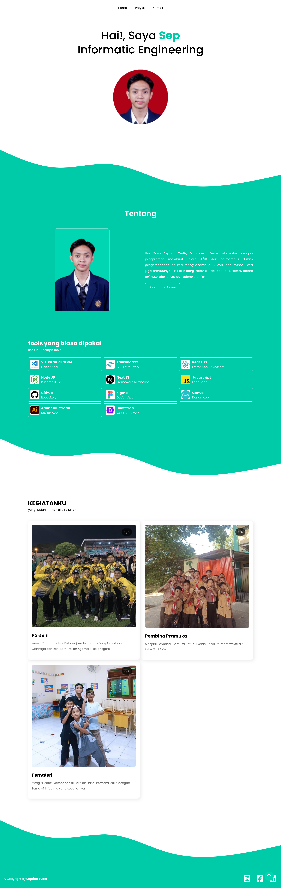

# Portfolio — Moch Septian Yudis Saputra

Deskripsi
---------
Situs portfolio statis yang menampilkan informasi personal, proyek/kegiatan, dan halaman kontak untuk Moch Septian Yudis Saputra. Dibangun sederhana dengan HTML, CSS, dan JavaScript untuk keperluan personal branding.

Link Youtube
-----
  <a href="https://youtu.be/_T5KykvYtJI" target="_blank">https://youtu.be/_T5KykvYtJI</a>

Preview
-----
  

Fitur
-----
- Halaman utama (index.html) dengan hero, tentang, dan navigasi.
- Halaman proyek (proyek.html) menampilkan kegiatan / portofolio.
- Halaman kontak (kontak.html) dengan formulir kontak sederhana dan informasi kontak.
- Animasi saat scroll menggunakan AOS.
- Efek pengetikan pada teks menggunakan Typed.js.
- Ikon menggunakan Font Awesome.
- Responsive layout dengan media query.

Teknologi
--------
- HTML5
- CSS3 (file utama: dist/css/style.css)
- JavaScript (file utama: dist/js/script.js)
- AOS (Animate On Scroll)
- Typed.js
- Font Awesome

Struktur (ringkas)
------------------
- index.html
- proyek.html
- kontak.html
- dist/
  - css/style.css
  - js/script.js
- assets/
  - images/...
- README.md

Menjalankan secara lokal
-----------------------
1. Buka folder proyek di VS Code atau file explorer.
2. Cara cepat: buka `index.html` di browser (double-click).
3. Lebih baik gunakan development server untuk menghindari masalah CORS:
   - Dengan Live Server (VS Code) — klik "Go Live".
   - Atau dari terminal:
     - Python 3: `python -m http.server 8000`
     - Node (http-server): `npx http-server . -p 8000`
   - Lalu buka `http://localhost:8000`.

Catatan debugging cepat
-----------------------
- Jika tampilan kosong atau tanpa gaya: periksa path CSS (`dist/css/style.css`) di Developer Tools → Network (pastikan tidak 404).
- Jika ikon Font Awesome tidak muncul: pastikan link CDN di head ter-load.
- Jika animasi AOS tidak bekerja: pastikan `https://unpkg.com/aos@next/dist/aos.js` dimuat dan `AOS.init()` dijalankan setelah DOM.
- Jika gambar tidak tampil: cek nama file (hindari spasi) atau encode spasi menjadi `%20`.

Deploy ke GitHub Pages
----------------------
1. Push repository ke GitHub.
2. Di repo → Settings → Pages → pilih branch (mis. main) dan folder (root).
3. Simpan, lalu akses `https://<username>.github.io/<repo>` setelah beberapa menit.

Kontribusi
----------
Perbaikan kecil (gambar, teks, CSS) boleh diajukan via pull request. Untuk perubahan besar, buat issue terlebih dahulu.

Lisensi
-------
Bebas digunakan untuk referensi pribadi. Cantumkan atribusi jika dibagikan ulang.

